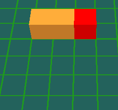
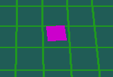
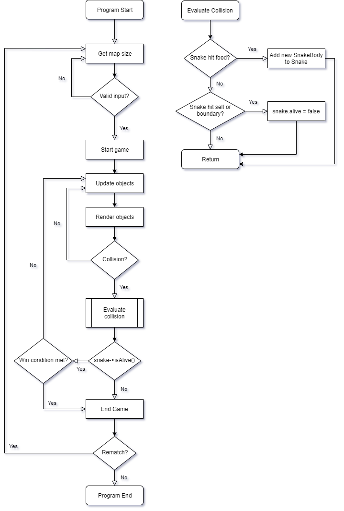

# SOFT356 C2: Snake 3D

#### Student No: 10550420 / Jamie Everett

## Software Used for Development:

<ul>
    <li>Visual Studio 2019</li>
    <li>nupengl.core v0.1.0.1 (NuGet)</li>
    <li>glm v0.9.9.600 (NuGet)</li>
</ul>

## How To Use Snake 3D:

Snake 3d is an update to the popular 2D game 'Snake' which was created in 19...

### Keybindings

Snake3D comes with the following controls to provide player interaction with the game:

**Movement Controls:**

| Input     | Action           |
| --------- | ---------------- |
| Up (↑)    | Face snake north |
| Down (↓)  | Face snake south |
| Left (←)  | Face snake west  |
| Right (→) | Face snake east  |

<br>

**Other Game Controls:**

| Input        | Action                   |
| ------------ | ------------------------ |
| P            | Pause/resume game        |
| Escape       | Close the program        |
| Mouse scroll | Move camera forward/back |

<br>

### How To Play

To start Snake3D, launch the executable file *Snake3D.exe*. Once running, the player will see a prompt in the console window asking them to choose a map size, the map sizes break down as follows:

| Map Size | Map Dimesions | Number of Blocks (% increase from previous size) |
| :------- | :-----------: | :--------------: |
| Small    | 7x7           | 49               |
| Medium   | 9x9           | 81 *(+~65%)*     |
| Large    | 11x11         | 121 *(+~50%)*    |
| Huge     | 13x13         | 169 *(+~40%)*    |

Once a valid selection has been made, the requested grid will be generated with a snake (*see figure 1.0*) and food item (*see figure 1.1*) positioned ontop of it. The game will start once the player presses a directional input (shown in the keybindings section).

|  |
| :--: |
| *Figure 1.0: Snake movement* |

|  |
| :--: |
| *Figure 1.1: Food animation* |


One the game has begun, the aim is to keep eating food blocks until there are no empty spaces, this satisfies the win condition of the game. If the snake's head either tries to leave the map boundary or hits another body segement, the lose condition is met and the player recieves a game over message.

At the end of a game (through either a win or loss) the players final score is displayed in the console. The player is then asked if they would like to play again and, if yes (Y), the program repeats from the map selection prompt. If the response is no (N), the program exits.

## Code Structure:

```
Snake3D
├── sounds
│   ├── death_sound.wav
│   ├── eating_sound.wav
│   └── win_sound.wav
├── Food.cpp
├── Food.h
├── Snake.cpp
├── Snake.h
├── Snake3D.cpp <-- ENTRY POINT
├── Snake3D.h
├── SnakeBody.cpp
└── SnakeBody.h
```

#### Snake3D.cpp

The code is made up of 4 cpp files, the main one being *Snake3D.cpp*. From this file the game logic is executed and frame updates are coordinated. *Snake3D.cpp* is also responsible for creating and destroying instances of the *Snake.cpp* and *Food.cpp* classes, while the *Snake.cpp* class is responsible for adding new *SnakeBody.cpp* objects to the current *Snake.cpp* object.

#### Snake.cpp

The main functions of this class are to draw the snake (looping though each *SnakeBody* child), update the snake's body position, move the snake in a specified direction and detect collisions (with either food, the boundary or the snake itself).

#### SnakeBody.cpp

Apart for the getters and setters for the XYZ positions and RGB values, the only function in this class is to draw the respective *SnakeBody* part. Each body part is constructed of a simple cube, the colour of which is either orange (default) or overriden to a different colour through the use of *setColour()*. An example of this is in *Snake.cpp*, where the first SnakeBody element in the body vector is set to red (to distinguish the head from the rest of the body).

#### Food.cpp

The final class is the food class. Like the *SnakeBody.cpp* class, apart from the getters and setters, the only function in the class is to draw the food object. Inside this draw method, the animation for the up and down floating motion and rotation is performed by modifying the values passed in to *glTranslatef()* and *glRotatef()*, respectively.

#### The display loop

*display(GLFWwindow\* window)* <-- (inside *Snake3D.cpp*)
<br>
The display loop is where most of the programs runtime is spent as it renders the snake, food and grid elements as well as checking for collisions (*snake->detectCollisions*).
It is also responsible for linking callbacks, handling frame timing/update frequency and updating the camera position.
<br>
Most of this function is repeatedly called until either *Escape* is pressed (which calls *exit(0)*) or a win/loss conditon is met (which ends the current game and returns the player to the map size selection prompt).

<br>

Below is a high-level flow diagram of the program execution logic:

<br><br>


|  |
| :--: |
| *Figure 2.0: High-level flow diagram* |

## Optimisations and Other Features:


## Program Background:


## Future Improvements:

